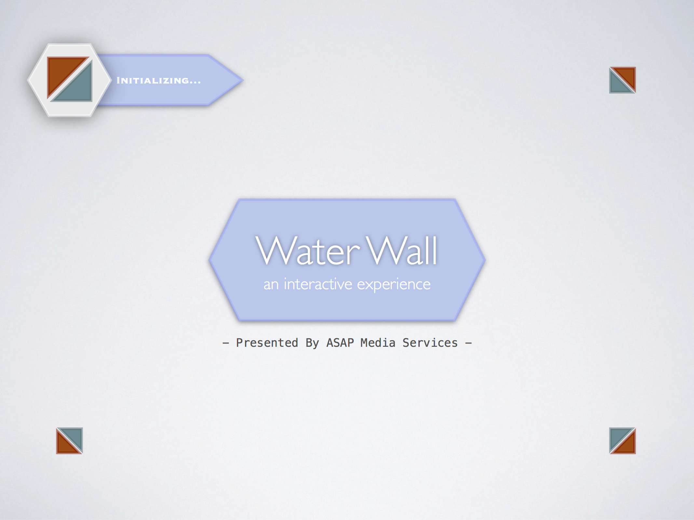

<html>
  <head>
    <title>Water Wall Project</title>
    
  </head>
  <body>

   Images for "Water Wall" Project

   

    
    
   

    If you have a suggestion for a better name, please let me know!

  </body>
</html>
